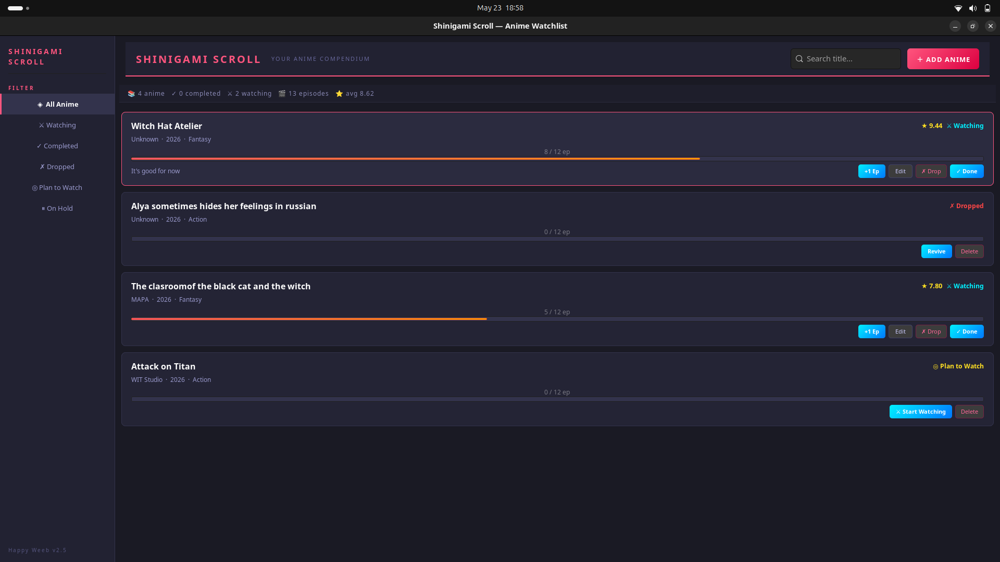

# 🐱 Shinigami Scroll

A personal anime tracking application written in C using GTK4.

Shinigami Scroll is a lightweight desktop application designed to help manage you anime watching journey.
You can keep track of anime titles, organize watch statuses, and store your entried using a simple CSV-based system.

##### Built with:
- ⚙️ C Programming Language
- 🖼️ GTK4 for the graphical user interface
- 💾 Local CSV storage for persistence

---
# ✨ Features

- Add and manage anime entries
- Track watching status
- Lightweight and fast
- Local data storage
- Simple GTK4 desktop interface
- No external database required
---
# 📁 Data Storage

All anime entries are stored locally in:
```bash
~/.local/share/shinigami_scroll/data.csv
```
If you are using another operating system, you can modify the output file path directly in the source code.
You can find the file path definition around:

```C
Line 335 of main.c
```

# 📦 Cloning the Repository
```bash
git clone https://github.com/Wizard77-exe/shinigami-scroll.git

# Go to the project directory
cd shinigami-scroll
```
--- 

# 🛠️ Requirements Before Compiling

- GCC
- GTK4 development libraries
- pkg-config
---

# 🐧 Compiling on Linux

```bash
gcc main.c -o shinigami-scroll `pkg-config --cflags --libs gtk4`

# to run
./shinigami-scroll
```
---

# 🪟 Compiling on Windows

Using MinGW or MSYS2:

```Powershell
gcc main.c -o shinigami-scroll $(pkg-config --cflags --libs gtk4)

# to run, click the icon created after compiling the program or in terminal:
./shinigami-scroll
```

---
# 📸 Screenshot


---

# 🚀 Future Plans

- API integration to search for anime online and watch online through a built-in player
- Theme Customization
- Add a built-in video player
- I don't know what else 😅

---

# 📄 License

This project is currently for personal and educational purposes.
---

# 👤 Author

Jaypee Dela Cruz
---


